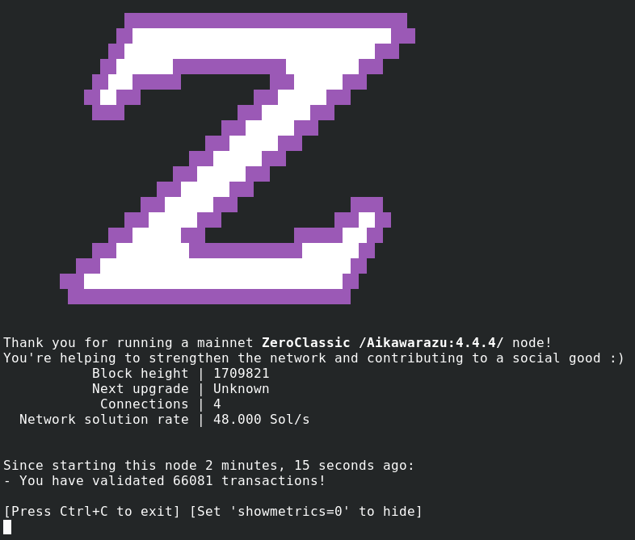

ZeroClassic v4.4.0

===========

What is ZeroClassic?
--------------

[ZeroClassic](https://zeroclassic.org/) is an implementation of the "Zerocash" protocol.
Based on Zcash code, ZeroClassic intends to offer the same standard of privacy
through a sophisticated zero-knowledge proving scheme that preserves
confidentiality of transaction metadata. 

What differentiates ZeroClassic from Zcash?
--------------

* No developer fees, founder rewards, funding streams or similar rules imposed to tax miners,
* No "engineered scarcity" known as "halving", you are never "late to the party",
* Proof of Work algorithm still resists ASICs,
* The team is not backed up by any company, we are just few people with passion for technology, freedom and privacy.


This software is the ZeroClassic client. It downloads and stores the entire history
of ZeroClassic transactions; depending on the speed of your computer and network
connection, the synchronization process could take a day or more once the
blockchain has reached a significant size.

<p align="center">
  
</p>

**ZeroClassic is experimental and a work in progress.** Use it at your own risk.

### Need Help?

* :speech_balloon: Join our community on [Discord](https://discord.gg/p4zdbhMrhy)

### Building

Install tools and libraries:

```
 sudo apt-get install \
 build-essential pkg-config libc6-dev m4 autoconf \
 libtool ncurses-dev unzip git python3 python3-zmq \
 zlib1g-dev curl bsdmainutils automake libtinfo5 zstd
 ```

Build ZeroClassic along with most dependencies from source by running the following command:

```
./zcutil/build.sh -j$(nproc)
```

License
-------

For license information see the file [COPYING](COPYING).
